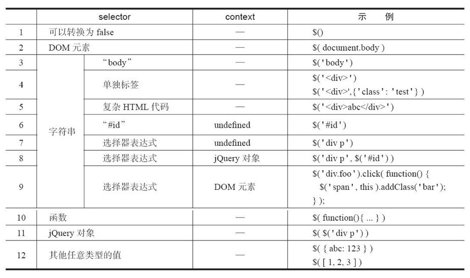
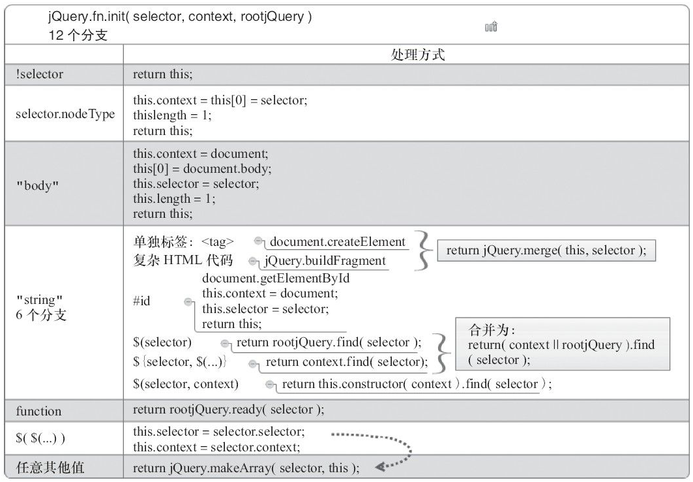

# jQuery.fn.init(selector, context, rootjQuery)

构造函数 jQuery.fn.init() 负责解析参数 selector 和 context 的类型, 并执行相应的逻辑, 最后返回 jQuery.fn.init() 的实例.

> 解析参数 selector 和 context 公有 12 个有效分支



## 源码分析

### 定义 jQuery.fn.init(selector, context, rootjQuery)

```js
jQuery.fn = jQuery.prototype = {
  constructor: jQuery,
  init: function (selector, context, rootjQuery) {
    var match, elem, ret, doc
  },
}
```

在 `init()` 构造函数定义中接受三个参数 selector、context、rootjQuery

- selector: 可以是任意类型的值, 但只有 undefined、DOM 元素、字符串、函数、jQuery 对象、普通 JavaScript 对象这几种类型有效
- context: 可以不传入, 或者传入 DOM 元素、jQuery 对象、普通 JavaScript 对象之一
- rootjQuery: 包含了 document 对象的 jQuery 对象, 用于 document.getElementById()查找失败、selector 是选择器表达式且未指定 context、selector 是函数的情况.

rootjQuery 定义与应用场景

```js
// document.getElementById() 查找失败
return rootjQuery.find(selector)

// slector 是选择器且未指定 context
return (context || rootjQuery).find(selector)

// selector 是函数
return rootjQuery.ready(selector)

// rootjQuery 定义
rootjQuery = jQuery(doucment)
```

## 参数 selector 可以转换为 false

参数 selector 可以转换为 false, 例如: undefined、空字符串、null 等, 则直接返回 this, 此时 this 是空 jQuery 对象, 其属性 length 等于 0.

```js
// Handle $('')、$(null) or $(undefined)
if (!selector) {
  return this
}
```

## 参数 selector 是 DOM 元素

如果参数 selector 有属性 nodeType, 则认为 selector 是 DOM 元素, 手动设置第一个元素和属性 context 指向该 DOM 元素、属性 length 为 1, 然后返回包含了该 DOM 元素引用的 jQuery 对象

```js
// Handle $(DOMELement)
if (selector.nodeType) {
  this.context = this[0] = selector
  this.length = 1
  return this
}
```

## 参数 selector 是字符串 'body'

如果参数 selector 是字符串 "body", 手动设置属性 context 指向 document 对象、第一个元素指向 body 元素、属性 length 为 1, 最后返回包含了 body 元素引用的 jQuery 对象

```js
// The body element only exists once, optimize finding it
if (selector === 'body' && !context && document.body) {
  this.context = document
  this[0] = document.body
  this.selector = selector
  this.length = 1
  return this
}
```

## 参数 selector 是其他字符串

如果参数 selector 是其他字符串, 则先检测 selector 是 HTML 代码还是 `#id`.

```js
// 处理参数是字符串
if (typeof selector === 'string') {
  // 判断是 HTML 代码 还是 #ID
  if (
    selector.charAt(0) === '<' &&
    selector.charAt(selector.length - 1) === '>' &&
    selector.length >= 3
  ) {
    // 如果是以 `<` 开头 `>` 结尾的  并且长度大于等于 3  跳过 正则 检查
    match = [null, selector, mull]
  } else {
    /**
     * 使用正则检查  quickExpr = /^(?:[^#<]*(<[\w\W]+>)[^>]*$|#([\w\-]*)$)/
     * 依次匹配 HTML 代码和 id 如果匹配成功 match 数组第一个元素为参数 selector, 第二个元素为匹配的 HTML 代码或 undefined 第三个元素为匹配的 id 或 undefined
     * quickExpr.exec('#target'); // ["#target",undefined,"target"]
     * quickExpr.exec('<div>'); // ["<div>","<div>",undefined]
     * quickExpr.exec('abc<div>'); // ["abc<div>","<div>",undefined]
     * quickExpr.exec('abc<div>abc#id'); // ["abc<div>abc#id","<div>",undefined]
     * quickExpr.exec('div'); // null
     * quickExpr.exec('<div></div>'); // ["<div></div>","<div></div>",undefined]
     */
    match = quickExpr.exec(selector)
  }
}
```

## 如果 selector 是单独标签

如果 selector 是单独标签, 就调用 document.createElement() 创建标签对应的 DOM 元素

```js
/**
 * 检查正则匹配结果
 * 如果 match[1] 不是 undefined 即 selector 是 HTML 代码 或者 match[2] 不是 undefined, 即参数 selector 是 #id 并且未传入 context
 */
if (match && (match[1] || !context)) {
  // HANDLE: $(html) -> $(array)
  if (match[1]) {
    context = context instanceof jQuery ? context[0] : context

    doc = context ? context.ownerDocument || context : document

    // 如果传入单个字符 并且是个单标签 直接创建 跳过其他
    // rsingleTag = /^<(\w+)\s*\/?>(?:<\/\1>)?$/,
    ret = rsingleTag.exec(selector)

    if (ret) {
      // jQuery.isPlainObject() 用于检测对象是否是纯粹的对象 即用对象直接量 {} 或者 new Object() 创建的对象
      if (jQuery.isPlainObject(context)) {
        selector = [document.createElement(ret[1])]
        // attr() 遇到特殊属性和事件类型时会执行同名 jQuery 方法
        jQuery.fn.attr.call(selector, context, true)
      } else {
        selector = [doc.createElement(res[1])]
      }
    }
  }
}
```

> 之所以把创建的 DOM 源码放入数组中, 是为了后面方便的调用 jQuery.merge() 方法, 此方法用于合并两个数组的元素到一个数组

## 参数 selector 是复杂 HTML 代码

如果参数 selector 是复杂 HTML 代码, 则利用浏览器 innerHTML 创建 DOM 元素

```js
{
 else {
   /**
    * 创建过程由 buildFragment 和 clean 实现
    * buildFragment 返回 -> { fragment: 含有转换后的 DOM 元素的文档片段 , cacheable: HTML代码是否满足缓存条件}
   */
   ret = jQuery.buildFragment([ match[1] ], [ doc ])
   /**
    * 如果满足缓存条件, 在使用前 先复制一份
   */
   selector = (ret.cacheable ? jQuery.clone(ret.fragment): rest.fragment).childNodes
 }

 // 将创建的 DOM 元素 合并到当前 jQuery 对象中返回
 return jQuery.merage(this, selector)
}
```

## 如果参数 selector 是 `#id`, 且未指定参数 context

如果参数 selector 是 `#id`, 且未指定参数 context, 则调用 document.getElementById() 查找含有指定 id 属性的 DOM 元素

```js
{
  // 查找含有指定 id 属性的 DOM 元素
  elem = document.getElementById(mathc[2])

  if (elem && elem.parentNode) {
    // 检查 id 是否相等
    if (elem.id !== match[2]) {
      return rootjQuery.find(selector)
    }

    this.length = 1
    this[0] = elem
  }

  this.context = document
  this.selector = selector
  return this
}
```

## 参数 selector 是选择器表达式

```js
// HANDLE: $(expr, $(...))
} else if (!context || context.jquery) {
  /**
   * 如果执行了上下文 且上下文是 jQuery 对象 执行 context.find() 方法
   * 如果没有指定上下文 就执行 rootjQuery.find()
  */
  return (context || rootjQuery).find(selector);

  // HANDLE: $(expr, context)
  // (which is just equivalent to: $(context).find(expr)
} else {
  // 如果指定了上下文 但上下文不是jQuery对象 则执行方法先创建一个包含 context 的 jQuery 对象, 然后调用 find() 方法
  return this.constructor(context).find(selector);
}
```

## 参数 selector 是函数

```js
// 如果是函数 就绑定 ready 事件
} else if (jQuery.isFunction(selector)){
  return rootjQuery.ready(selector)
}
```

## 如果参数 selector 是 jQuery 对象

```js
// 如果参数包含 selector 就认为是 jQuery 对象
if (selector.selector !== undefined) {
  // 复制他的属性 selector 和 context
  this.selector = selector.selector
  this.context = selector.context
}
```

## 参数 selector 是任意其他值

```js
/**
 * 如果 selector 是数组或伪数组, 则添加到当前 jQuery 对象中
 * 如果 selector 是 JavaScript 对象, 则作为第一个元素放入当前 jQuery 对象中
 * 如果是其他类型的值, 则作为第一个元素放入当前 jQuery 对象中
 * 最后返回当前 jQuery 对象
 */
return jQuery.makeArray(selector, this)
```

## 总览


